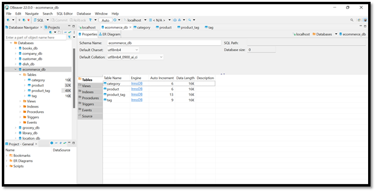
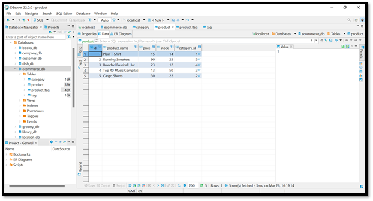

# E-Commerce-Shopping-Back-End

## Table of Contents

- [Description](#description)
- [Installation](#installation)
- [Usage](#usage)
- [Examples](#examples)
- [Contact Information](#contact)

## Description

This application is the back end of an E-Commerce site that allows users to control their products, categories and tags. The user can view all the products associated with a category and tag, the categories together with their tags and the tags with all their associated products. Furthermore, users are able to create, update and delete products, categories and tags.

## Installation

- node.js needs to be installed prior to use
- open terminal
- clone the repo: `https://github.com/NAli3107/E-Commerce-Shopping-Back-End`
- cd into new directory
- download JSON packages by entering `npm i`
- create `.env` file 
- to connect to the database run `mysql -u root -p` and enter password from .env file
- source the schema.sql
- seed the data by running `npm run seed`
- enter `npm start`

## Usage

This application will allow users to view, create, update, and delete categories, products, and tags.

```
View video to see MySQL walk through via 
View video to walk through of the API routes
View video to see Postman walk through via
```

## Examples

ScreenshotS of Database:





Screenshot of Postman:


## Contact

Email Address: Nadiraali188a@gmail.com

Linkedin Profile: [LinkedIn](https://www.linkedin.com/in/nadira-ali-09a182106/)

Github: [Profile](https://github.com/NAli3107)

Github: [Repo](https://github.com/NAli3107/E-Commerce-Shopping-Back-End)
